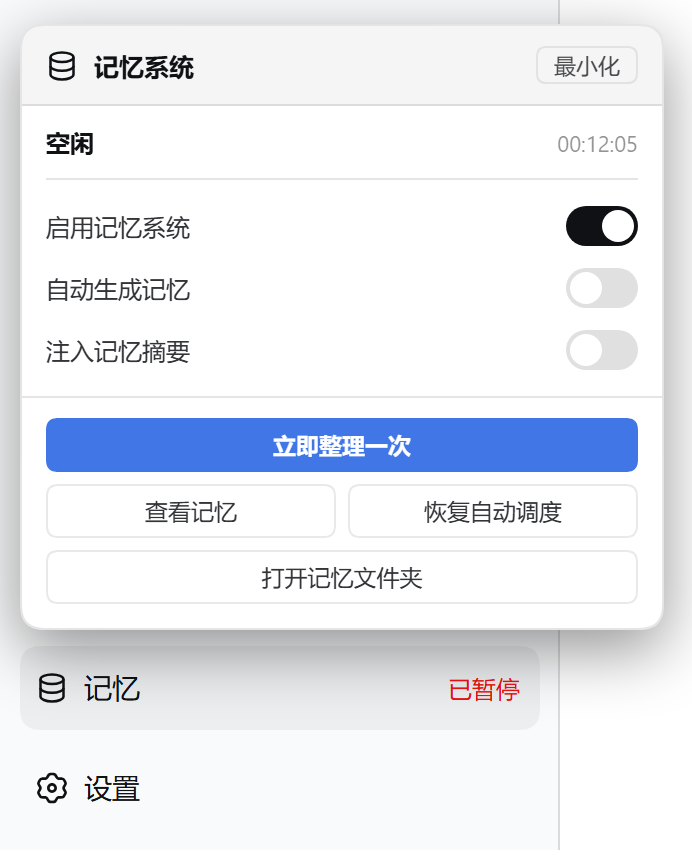
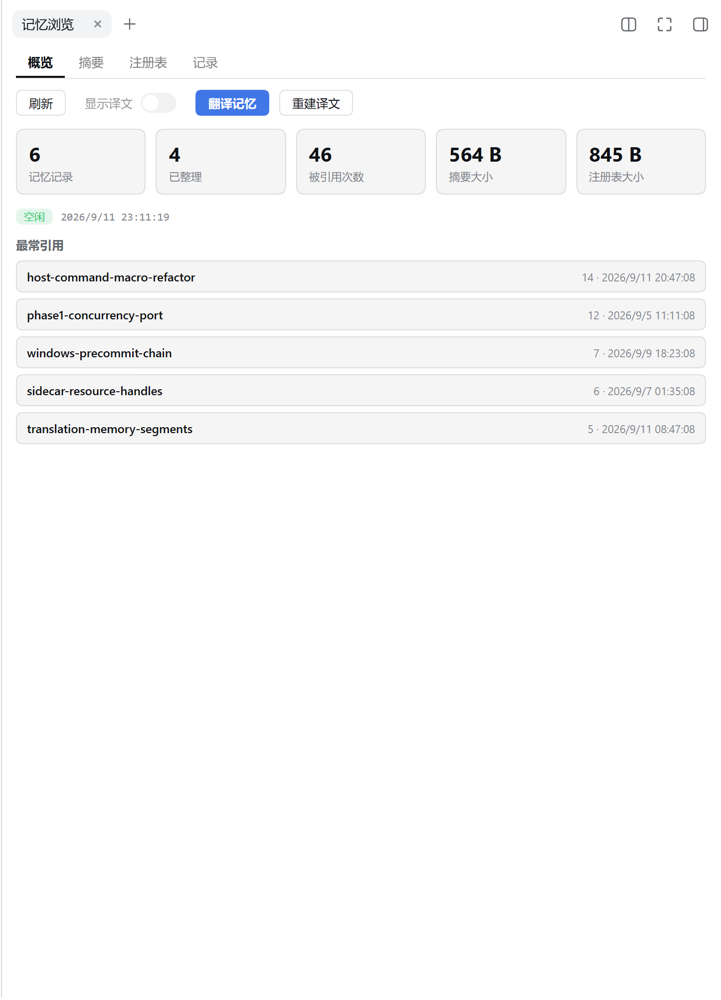
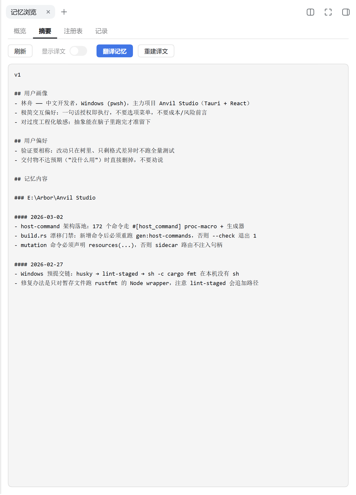
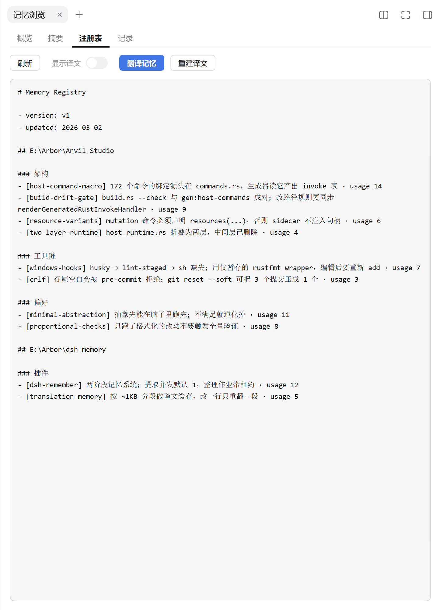
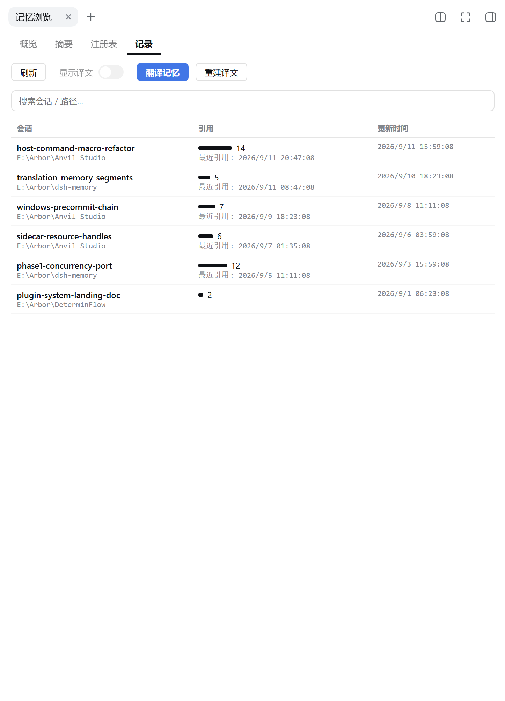

# dsh-memory-plugin

[](https://github.com/Arborsm/dsh-memory-plugin/actions/workflows/ci.yml)
[](LICENSE)

[English](README.md)

[DeepSeek Harness](https://github.com/deepseek-ai/deepseek-harness)(dsh)的跨会话长期记忆插件。

它在你不使用的时候回顾最近的会话,把里面有价值的经验提炼成一套普通的 Markdown 文件;之后的每一次对话,模型都会带着这份记忆的摘要工作,需要细节时自己去 grep 原文。

没有向量库、没有外部服务,记忆就是 `~/.dsh-memory/` 下可以直接打开、搜索、用 git 管理的文件。

## 特性

- **自动提取**:空闲会话在后台被扫描、脱敏、提炼,全程无需干预
- **自动整理**:新经验被增量合并进记忆文件,过时、无人引用的内容自动淘汰
- **自动召回**:每次对话注入记忆摘要(可配置 token 上限),模型按需检索
- **可读可控**:侧栏状态面板、记忆浏览页、设置页,随时查看和暂停
- **多语言**:记忆可一键翻译,增量缓存,改一行只重翻一段
- **可迁移**:gzip bundle 导出 / 导入,按内容哈希去重合并

## 截图

侧栏底部的记忆入口,点开是状态面板。

<p align="center">
  
</p>

记忆浏览页:概览、摘要、注册表、记录。

<p align="center">
  
  
</p>

<p align="center">
  
  
</p>

## 安装

```sh
pnpm install && pnpm build

# 装到某个 profile
dsh plugin --profile <name> add <path/to>/dsh-memory-plugin
```

安装后重启 `dsh web`。开发期也可以不安装,直接从工作区加载(在 dsh checkout 根目录执行):

```sh
pnpm dsh web --patch <path/to>/dsh-memory-plugin/cordis.dev.yml
```

注意 `--patch` 要写在 `--port` 前面,否则 commander 报 `unknown option '--patch'`。

## 配置

所有字段都有默认值,装上即用。覆盖方式:`cordis.yml` 或 dev overlay 的 `config:` 块,字段定义见 `src/config.ts`。

常用项:

| 字段 | 默认 | 说明 |
|---|---|---|
| `enabled` | `true` | 总开关 |
| `generateMemories` | `true` | 是否自动提取与整理 |
| `useMemories` | `true` | 是否向对话注入记忆摘要 |
| `extractModel` / `consolidationModel` | `''` | `provider/model`,空 = 跟随默认模型 |
| `workspaceDir` / `dbPath` | `''` | 空 = `~/.dsh-memory/` 下 |
| `summaryTokenLimit` | `2500` | 注入摘要的 token 上限 |
| `scanIntervalMinutes` | `15` | 后台扫描间隔 |
| `minRolloutIdleHours` | `1` | 会话静置多久才可提取 |
| `maxUnusedDays` | `30` | 无人引用的记忆保留天数 |

完整字段(调度、重试、并发、整理器工具黑名单等)共 23 项,见 `src/config.ts`,均可在设置页图形化修改。

## 记忆文件

```text
~/.dsh-memory/
├── memories/                  # git 工作区
│   ├── MEMORY.md              # 注册表:所有记忆的索引
│   ├── memory_summary.md      # 注入对话的摘要
│   ├── rollout_summaries/     # 每条记忆的来源证据
│   ├── skills/                # 沉淀下来的技能
│   └── …                      # 译文、临时笔记等
└── memories.sqlite            # 提取队列与作业状态
```

## 开发

```sh
pnpm build        # 构建(tsdown,宿主 + 浏览器两个 bundle)
pnpm typecheck    # tsc --noEmit
pnpm test         # node --test
pnpm shots        # 重新生成上面这些截图(夹具 + 无头 Chrome)
```

仓库结构、约定与调试方法见 [AGENT.md](AGENT.md)。
